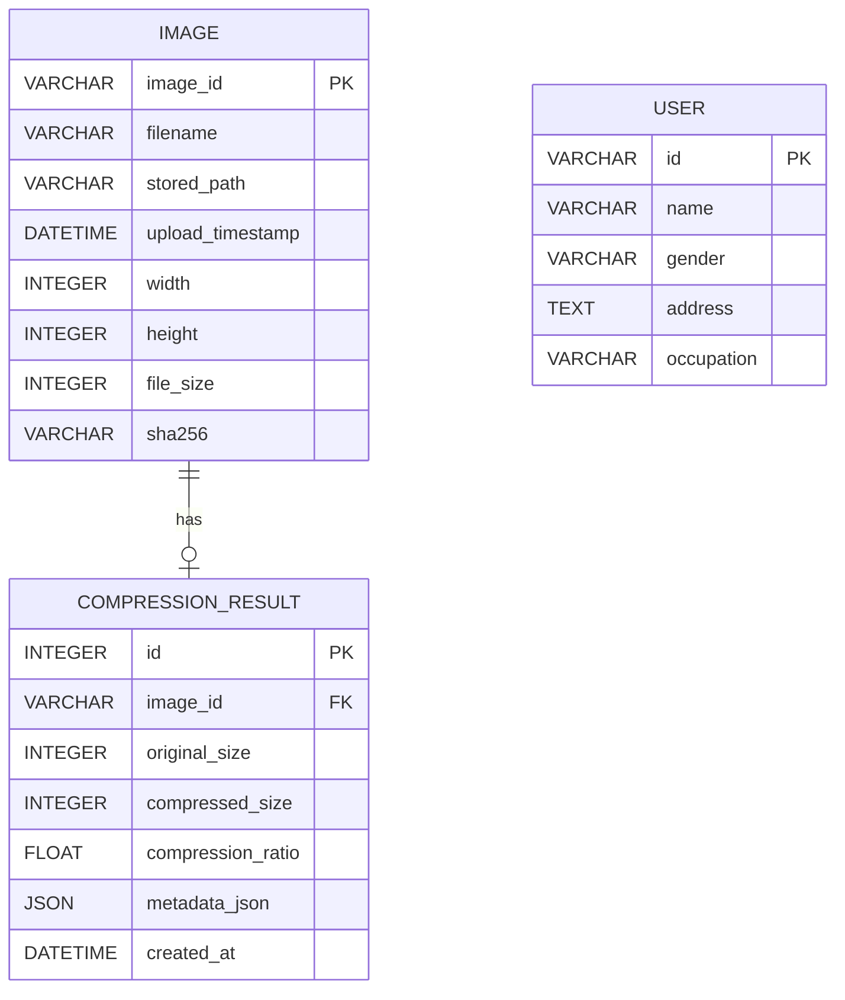
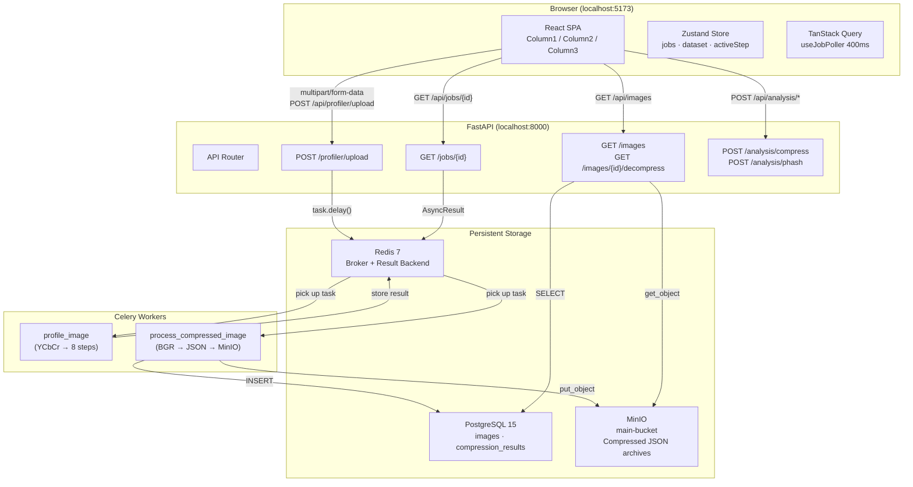
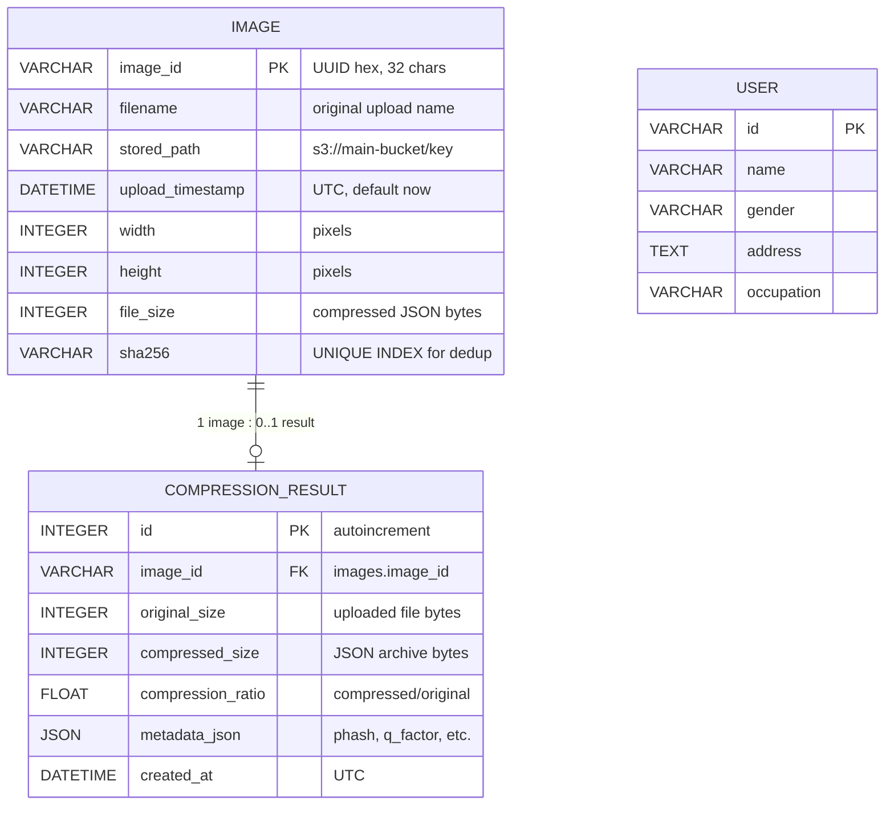
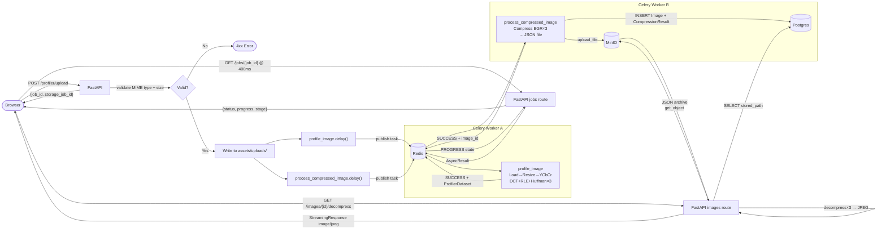
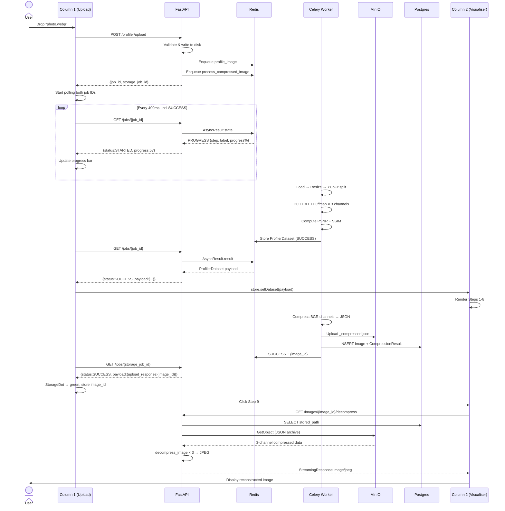

# AlgoStore — DCT+Huffman Image Compression Profiler

[](https://python.org)
[](https://fastapi.tiangolo.com)
[](https://react.dev)
[](https://docs.celeryq.dev)
[](LICENSE)
[]()

---

## 1. Project Overview

AlgoStore is an interactive image-compression profiler that implements the core JPEG pipeline — DCT quantisation, run-length encoding, and Huffman coding — from scratch, then exposes every intermediate step as a live visualisation in a browser. Users upload any PNG, JPEG, WebP, BMP, or TIFF image; the backend decomposes it into its Y, Cb, and Cr channels, runs the full 8-step pipeline on each, and streams the results back to a React dashboard that renders heatmaps, Huffman trees, RLE block strips, a code-stream inspector, and a side-by-side quality comparison.

The project was built as a Design and Analysis of Algorithms course capstone. Its goal is to make abstract data-structures — min-heaps, DCT coefficients, prefix-free codes — tangible and inspectable rather than black-boxed inside a library. Engineers and students can upload any image and immediately see how each algorithmic choice (quantisation factor, block size) affects the final bitstream length and reconstruction quality (PSNR / SSIM).

Compressed images are stored in MinIO (S3-compatible object storage) so they can later be retrieved and decompressed back to a JPEG — demonstrating the full round-trip pipeline. A gallery view in the UI lets users browse every previously-compressed image and download the reconstructed version.

| Layer | Technology |
|---|---|
| **Frontend** | React 18 + TypeScript, Vite 6, TanStack Query v5, Zustand 5, D3 v7, Recharts |
| **Backend API** | FastAPI 0.135, Uvicorn, Python 3.13 |
| **Async Workers** | Celery 5.6 with Redis 7 as broker and result backend |
| **Object Storage** | MinIO (S3-compatible), accessed via `boto3` |
| **Relational DB** | PostgreSQL 15 via SQLAlchemy 2 + psycopg3 |
| **Image Processing** | OpenCV, NumPy, SciPy (DCT/IDCT), scikit-image (SSIM) |
| **Containerisation** | Docker Compose (Postgres, Redis, MinIO) |

---

## 2. Architecture Overview

The system is structured as three independent runtime layers that share data through well-defined interfaces:

```
Browser (React SPA)
      │  HTTP (REST) via Vite proxy → /api/*
      ▼
FastAPI (port 8000)
  ├── POST /profiler/upload  → enqueues 2 Celery tasks, returns job IDs
  ├── GET  /jobs/{id}        → proxies Celery result-backend state
  ├── GET  /images           → queries Postgres for image catalogue
  ├── GET  /images/{id}/decompress → downloads from MinIO, decompresses
  └── POST /analysis/*       → synchronous (no Celery) compress + pHash
      │
      ├── Celery Worker (profile_image task)
      │     Runs DCT+RLE+Huffman on Y/Cb/Cr channels
      │     Stores result in Redis (result backend, TTL 1 h)
      │
      └── Celery Worker (process_compressed_image task)
            Compresses all 3 BGR channels → JSON file
            Uploads JSON to MinIO → records Image + CompressionResult in Postgres
            Stores result in Redis
```

**Design patterns in use:**

- **Fan-out dispatch**: A single `POST /profiler/upload` spawns two independent Celery tasks. The frontend tracks both via separate job IDs and merges their results in the UI.
- **REST + polling**: The frontend polls `GET /jobs/{task_id}` at 400 ms intervals using TanStack Query's `refetchInterval`. There is no WebSocket; simplicity was favoured.
- **Repository pattern**: `ImageRepository`, `JobRepository`, and `ResultsRepository` abstract all SQLAlchemy queries away from the route handlers.
- **JSON over pickle**: The compressed channel data is serialised as JSON (not `pickle`) before writing to disk and uploading to MinIO. This is a deliberate security decision — pickle can execute arbitrary Python on deserialisation.
- **BFF (Backend-for-Frontend)**: FastAPI acts as a thin orchestration layer. All heavy computation happens inside Celery workers, keeping HTTP response times fast.

**Data flow for a typical upload:**

1. User drops an image in the browser.
2. Browser `POST`s the file to `/profiler/upload`.
3. FastAPI writes the file to `assets/uploads/`, dispatches `profile_image` and `process_compressed_image` tasks, and returns two Celery task UUIDs.
4. Browser starts polling both UUIDs at 400 ms.
5. `profile_image` resizes the image to ≤ 128 px, converts to YCrCb, runs the 8-step pipeline on each channel, reports PROGRESS states, and stores the full visualisation payload in Redis.
6. `process_compressed_image` compresses all 3 BGR channels, writes a JSON archive, uploads it to MinIO `main-bucket`, records `Image` + `CompressionResult` rows in Postgres.
7. When `profile_image` returns SUCCESS, the browser receives the `ProfilerDataset` in the poll response and renders all 8 visualisation steps.
8. When `process_compressed_image` returns SUCCESS, the `storageStatus` indicator turns green and the `image_id` is extracted for decompression in Step 9.
9. User navigates to Step 9 in the visualiser; the browser fetches `/images/{image_id}/decompress`, which downloads the JSON from MinIO, runs IDCT+Huffman decode on each channel, and streams a JPEG back.

---

## 3. Folder Structure

```
AlgoStore_DAA/
├── app/                          # Python backend package
│   ├── api/                      # FastAPI application layer
│   │   ├── main.py               # FastAPI app factory, CORS, middleware
│   │   ├── config.py             # API constants (file limits, allowed types, Q factor)
│   │   ├── deps.py               # FastAPI dependency injection (DB session)
│   │   ├── routes/               # Route handlers, one file per resource
│   │   │   ├── images.py         # /profiler/upload, /images, /images/{id}/decompress
│   │   │   ├── jobs.py           # /jobs/{task_id} (poll), DELETE /jobs/{task_id} (cancel)
│   │   │   └── analysis.py       # /analysis/compress, /analysis/phash (sync, no Celery)
│   │   └── schemas/              # Pydantic request/response models
│   │       ├── image.py          # UploadResponse, StoredImageItem, StoredImagesResponse
│   │       ├── job.py            # JobPollResponse
│   │       └── analysis.py       # (reserved for future sync-analysis schemas)
│   │
│   ├── config/
│   │   └── config.py             # Pydantic Settings: Postgres DSN, password-file support
│   │
│   ├── core/                     # Pure algorithmic core — no I/O, no DB
│   │   ├── compression.py        # HuffmanNode, Huffman, dct_quantize_image, compress_image, decompress_image
│   │   ├── phash.py              # compute_phash (64-bit DCT perceptual hash), phash_distance
│   │   ├── exact_hash.py         # SHA-256 file-level deduplication helper
│   │   └── similarity.py         # (reserved for future image-similarity features)
│   │
│   ├── database/                 # SQLAlchemy ORM layer
│   │   ├── base.py               # Declarative Base
│   │   ├── connection.py         # Engine + SessionLocal factory from .env
│   │   ├── session.py            # get_db() FastAPI dependency (yields session)
│   │   ├── models.py             # ORM models: User, Image, CompressionResult
│   │   └── repositories/         # Data access objects
│   │       ├── images.py         # ImageRepository (CRUD for Image rows)
│   │       ├── jobs.py           # JobRepository (future: persisted job history)
│   │       └── results.py        # ResultsRepository (CompressionResult queries)
│   │
│   ├── services/                 # Orchestration — wires core + DB + storage
│   │   ├── analysis_service.py   # compute_psnr, compute_ssim, get_compression_analysis, get_phash_debug
│   │   ├── job_service.py        # get_job_status, cancel_job (wraps Celery AsyncResult)
│   │   ├── storage_service.py    # download_and_decompress (MinIO → decompress → JPEG bytes)
│   │   └── upload_service.py     # Upload class: MinIO put + Postgres Image/CompressionResult write
│   │
│   ├── utils/                    # Standalone utilities
│   │   ├── __init__.py           # Re-exports MinHeap
│   │   ├── heap.py               # MinHeap (used by Huffman), legacy Heap class
│   │   ├── image_io.py           # Image read/write helpers
│   │   ├── rle.py                # Standalone RLE helpers (unused by main pipeline; kept for reference)
│   │   └── file_storage.py       # Local disk read/write helpers
│   │
│   ├── worker/                   # Celery task definitions
│   │   ├── __init__.py
│   │   ├── celery_app.py         # Celery instance: Redis broker + result backend, JSON serialisation
│   │   ├── profiler_task.py      # profile_image task: YCbCr → 8-step pipeline → Redis payload
│   │   └── tasks.py              # process_compressed_image task: compress → MinIO → Postgres
│   │
│   └── tests/                    # Integration + unit tests
│       ├── test_compression.py   # Round-trip compress/decompress correctness
│       ├── test_minio.py         # MinIO bucket upload/download
│       ├── test_pipeline.py      # Full Celery task end-to-end
│       └── test_redis_connection.py  # Redis connectivity smoke test
│
├── frontend/                     # React + TypeScript single-page application
│   ├── index.html                # Vite entry point
│   ├── package.json              # NPM manifest, dev/prod scripts
│   ├── vite.config.ts            # Vite config: /api proxy → localhost:8000
│   ├── src/
│   │   ├── main.tsx              # React root mount, QueryClientProvider
│   │   ├── App.tsx               # 3-column IDE layout, theme toggle
│   │   ├── store.ts              # Zustand global state: jobs, dataset, channel, step, logs
│   │   ├── types.ts              # TypeScript interfaces: JobEntry, ProfilerDataset, StepPayload, etc.
│   │   ├── mockData.ts           # LCG-seeded mock ProfilerDataset for offline development
│   │   ├── index.css             # Global reset, @font-face (Inter, JetBrains Mono), dark-mode class
│   │   ├── api/
│   │   │   └── hooks.ts          # uploadImage(), useStoredImages(), useJobPoller()
│   │   └── components/
│   │       ├── Header.tsx        # Title bar, theme toggle button
│   │       ├── Column1.tsx       # Upload dropzone, job queue list, pipeline log panel
│   │       ├── Column2.tsx       # Channel selector, SourceMonitor canvas, step tabs, step renderers
│   │       ├── Column3.tsx       # PSNR/SSIM metrics, execution timing chart, memory estimate chart
│   │       └── steps/
│   │           ├── Step1Padded.tsx     # Original + zero-padded canvas with 8×8 block ruler
│   │           ├── Step2DCT.tsx        # DCT coefficient heatmap + per-block energy bars
│   │           ├── Step3QMatrix.tsx    # 8×8 JPEG quantisation matrix, 3-panel interactive slider
│   │           ├── Step4Quantized.tsx  # Quantised-block sparsity map + coefficient decay chart
│   │           ├── Step5RLE.tsx        # Run-length encoded pair block strip visualisation
│   │           ├── Step6Huffman.tsx    # D3 Huffman tree waterfall + Kraft inequality meter
│   │           ├── Step7CodeTable.tsx  # Code table browser + bitstream chip visualiser
│   │           ├── Step8Reconstruct.tsx # IDCT side-by-side comparison + diff heatmap
│   │           └── Step9Decompress.tsx # Full-round-trip gallery: fetches /images/{id}/decompress
│
├── docker/
│   ├── docker-compose.yml        # Postgres 15, Redis 7, MinIO services
│   ├── api.Dockerfile            # FastAPI container (future deployment)
│   └── worker.Dockerfile         # Celery worker container (future deployment)
│
├── docs/                         # Design documents, weekly progress notes, algo explainers
│   ├── architecture.md
│   ├── brainstorm.md
│   ├── compression-migration.md
│   └── algo-explain/
│       └── huffman.md
│
├── assets/
│   └── uploads/                  # Temporary landing zone for uploaded images
│
├── .env                          # Local environment variables (not committed)
├── .env.example                  # Template with all required variables
├── setup.py / setup.cfg          # Python package install for `app`
└── Algostore.code-workspace      # VS Code workspace
```

---

## 4. File Explanations

### Backend — Core Algorithm (`app/core/`)

**`app/core/compression.py`**
The heart of the project. Implements the full JPEG-like compression pipeline from scratch.

- `HuffmanNode` — binary tree node with `value`, `frequency`, and `left`/`right` children. Implements `__lt__`/`__gt__` so nodes can be compared in the `MinHeap`.
- `Huffman` — stateful class that holds the built tree. Methods: `rle_encode(image_array)` (flatten → run-length pairs), `huffman_encode(freq_table)` (builds tree via `MinHeap`, returns `{symbol: bitcode}` dict), `huffman_decode(bitstream, code_to_symbol)`, `rle_decode(rle_encoded, shape)`.
- `dct_quantize_image(gray, q_factor)` — pads image to nearest 8×8 multiple, shifts by −128, applies 2D DCT block-by-block (using SciPy `dct` with `norm="ortho"`), divides by the scaled JPEG luminance quantisation matrix. Returns `(quantized_int16, orig_shape, padded_shape)`.
- `dct_dequantize_reconstruct(quantized, orig_shape, padded_shape, q_factor)` — inverse path: multiply by Q-matrix, IDCT, clip to [0, 255].
- `compress_image(channel, quantization_factor, capture_steps)` — top-level function. When `capture_steps=True`, also returns a `steps` dict with all intermediate arrays (used by the async visualisation task and the sync `/analysis/compress` endpoint).
- `decompress_image(bitstream, code_to_symbol, meta)` — reconstructs a grayscale image from a stored bitstream.
- **Imports**: `numpy`, `cv2`, `scipy.fft.dct/idct`, `collections.Counter`, `MinHeap`.

**`app/core/phash.py`**
Computes a 64-bit DCT perceptual hash (pHash) for image deduplication and similarity comparisons.

- `compute_phash(image, hash_size, highfreq_factor, debug)` — resizes to 32×32, applies 2D DCT, extracts 8×8 low-frequency block, thresholds against the mean (excluding DC component), packs 64 bits into a 16-char hex string. `debug=True` returns all 6 intermediate arrays for the pHash visualiser.
- `phash_distance(hash_a, hash_b)` — Hamming distance via XOR bit-count.

**`app/core/exact_hash.py`**
SHA-256 based exact deduplication helper used before MinIO uploads.

**`app/utils/heap.py`**
- `MinHeap` — array-based min-heap with `push(node)` and `pop()`. Used exclusively by `Huffman.huffman_encode`. Operates on `HuffmanNode` objects via their `__lt__` comparison.
- `Heap` / `heapify` / `insertNode` / `extractNode` — legacy fixed-size heap implementation retained for reference (not used by the production pipeline).

---

### Backend — API Layer (`app/api/`)

**`app/api/main.py`**
FastAPI application factory. Registers three routers (`images`, `jobs`, `analysis`), configures CORS for Vite dev server origins (`localhost:5173`, `localhost:3000`), and adds an `X-Process-Time` response header middleware for latency monitoring.

**`app/api/config.py`**
API-level constants:
- `MAX_UPLOAD_BYTES = 20 MB`
- `ALLOWED_CONTENT_TYPES = {image/png, image/jpeg, image/webp, image/bmp, image/tiff}`
- `DEFAULT_Q_FACTOR = 24.0` (scales the JPEG luminance Q-matrix)
- `UPLOAD_DIR = assets/uploads/`

**`app/api/routes/images.py`**
Three endpoints:
1. `POST /profiler/upload` — validates MIME type and file size, writes to `UPLOAD_DIR` with a `sha256_prefix_uuid4.ext` name, dispatches `profile_image` and `process_compressed_image` Celery tasks, returns both task IDs.
2. `GET /images/{image_id}/decompress` — delegates to `storage_service.download_and_decompress`, streams a JPEG response with a sanitised `Content-Disposition` header.
3. `GET /images` — paginatable listing with `outerjoin` on `CompressionResult` to include compression ratios.

**`app/api/routes/jobs.py`**
- `GET /jobs/{task_id}` — maps Celery states (`PENDING`, `STARTED`, `PROGRESS`, `SUCCESS`, `FAILURE`, `REVOKED`) to a `JobPollResponse` with a numeric `progress` field and optional `payload` on success.
- `DELETE /jobs/{task_id}` — calls `cancel_job` to revoke the Celery task.

**`app/api/routes/analysis.py`**
- `POST /analysis/compress` — synchronous path: decodes uploaded image with OpenCV, calls `get_compression_analysis`, serialises numpy arrays to lists, returns metrics + steps.
- `POST /analysis/phash` — returns all 6 pHash intermediate arrays as JSON lists.

**`app/api/deps.py`**
`get_db()` generator — yields a SQLAlchemy `Session` and ensures `session.close()` in a `finally` block. Used as a FastAPI `Depends` injection.

---

### Backend — Services (`app/services/`)

**`app/services/upload_service.py`**
`Upload` class:
- Connects to MinIO via `boto3` with S3v4 signatures. Auto-creates `main-bucket` if absent.
- `upload(path, obj_name, metadata, **kwargs)` — pre-computes SHA-256, checks for duplicate in Postgres before touching MinIO (avoids wasted uploads), uploads the file, then writes `Image` + `CompressionResult` rows in a single transaction with rollback on failure.
- Returns a dict with `image_id`, `stored_path`, `sha256`. Returns `{"success": True, ...existing record}` on a duplicate SHA-256.

**`app/services/storage_service.py`**
`download_and_decompress(image_id)`:
- Queries Postgres for the `stored_path` (`s3://<bucket>/<key>`).
- Fetches the JSON archive from MinIO.
- Deserialises each channel's `{bitstream, code_to_symbol, meta}` and calls `decompress_image`.
- Merges 3 decompressed channels with `cv2.merge`, encodes as JPEG at quality 95, returns `(jpeg_bytes, original_filename)`.

**`app/services/analysis_service.py`**
- `compute_psnr(original, reconstructed)` — MSE-based PSNR in dB.
- `compute_ssim(original, reconstructed)` — delegates to `skimage.metrics.structural_similarity`.
- `get_compression_analysis(image, q_factor)` — converts to grayscale, calls `compress_image` with `capture_steps=True`, computes PSNR + SSIM, returns combined result dict.
- `get_phash_debug(image)` — thin wrapper around `compute_phash(image, debug=True)`.

**`app/services/job_service.py`**
- `get_job_status(task_id)` — reads `AsyncResult` from Celery's result backend (Redis). Returns a normalised dict with `status`, `progress`, and `result`/`error` fields.
- `cancel_job(task_id)` — calls `AsyncResult.revoke(terminate=True)`.

---

### Backend — Workers (`app/worker/`)

**`app/worker/celery_app.py`**
Creates the Celery instance with Redis as both broker and result backend. Forces JSON serialisation for all tasks and results (no pickle). Sets `result_expires=3600` so the frontend can poll results after a page refresh.

**`app/worker/profiler_task.py`** — `profile_image` task
1. Loads image with OpenCV.
2. Resizes to ≤ 128 px (`MAX_DIM`) on the longest dimension — keeps Redis payload manageable.
3. Converts BGR → YCrCb (`cv2.COLOR_BGR2YCrCb`) and splits into Y, Cr, Cb.
4. Calls `_profile_channel` on each, which runs the full DCT → quantise → RLE → Huffman pipeline and returns 8 named step arrays.
5. Computes PSNR and SSIM on the Y channel's original vs reconstructed pixels.
6. Reports `PROGRESS` state updates after each major step.
7. Returns a `ProfilerDataset` dict: `{metadata, metrics, channels: {y_channel, cb_channel, cr_channel}}`.

**`app/worker/tasks.py`** — `process_compressed_image` task
1. Computes pHash.
2. Calls `compress_image` on each BGR channel (not YCbCr, because `decompress_image` reconstitutes BGR).
3. Serialises all 3 channels' `(bitstream, code_to_symbol, meta)` into a JSON file (`<stem>_compressed.json`).
4. Uploads to MinIO via `Upload().upload(...)`.
5. Deletes the JSON temp file, optionally deletes the source image.

---

### Backend — Database (`app/database/`)

**`app/database/models.py`**
Three SQLAlchemy ORM models:
- `User` — unused in the current pipeline; present for future multi-user support.
- `Image` — image catalogue row. Fields: `image_id` (UUID hex PK), `filename`, `stored_path` (`s3://...`), `upload_timestamp`, `width`, `height`, `file_size`, `sha256` (UNIQUE, indexed).
- `CompressionResult` — one-to-one with `Image`. Fields: `id` (autoincrement PK), `image_id` (FK), `original_size`, `compressed_size`, `compression_ratio`, `metadata_json` (JSON blob), `created_at`.

**`app/database/connection.py`**
Builds the `postgresql+psycopg://` DSN from `.env`, creates the SQLAlchemy engine and `SessionLocal` factory.

**`app/database/repositories/images.py`**
`ImageRepository` — CRUD methods: `get_by_id`, `get_by_sha256`, `list_all`, `add`, `delete`.

---

### Frontend (`frontend/src/`)

**`store.ts`**
Zustand store — single source of truth for the entire UI:
- `jobs: JobEntry[]` — ordered list of all submitted jobs (newest first).
- `dataset: ProfilerDataset | null` — the last successful `profile_image` payload.
- `activeChannel: ChannelKey` — `"y_channel"` | `"cb_channel"` | `"cr_channel"`.
- `activeStep: number` — 1–9.
- `selectedBlock: [row, col] | null` — the 8×8 block selected in the source monitor canvas.
- `currentJobId: string | null` — tracks which job's `imageId` Column2 should use for Step 9.
- `logs: string[]` — rolling log of the last 200 pipeline events.

**`api/hooks.ts`**
- `uploadImage(file)` — `FormData` POST to `/api/profiler/upload`.
- `useJobPoller(jobId, enabled)` — TanStack Query with `refetchInterval: 400 ms` until `SUCCESS` or `FAILURE`.
- `useStoredImages(limit)` — one-shot fetch of `/api/images`.

**`App.tsx`**
Root component. Three-column flex layout (22% / flex-1 / 25%). Applies `dark-mode` class to `<html>` when the Zustand theme state changes.

**`components/Column1.tsx`**
- `Dropzone` — drag-and-drop or click-to-browse file input. On file selection: adds a pending `JobEntry` to the store, calls `uploadImage`, receives `job_id` + `storage_job_id`, starts two `useJobPoller` instances.
- `QueueManager` — renders the `jobs` array as a table with file name, current stage, animated progress bar, and dual `StatusDot` / `StorageDot` indicators.
- `LogPanel` — 200-line rolling terminal log with colour-coded lines (red for errors, green for success).

**`components/Column2.tsx`**
- Channel selector tabs (Y / Cb / Cr).
- `SourceMonitor` — HTML canvas rendering the padded grayscale image with a yellow 8×8 block grid overlay. Click-to-select blocks updates `selectedBlock` in the store.
- Step tabs (1–9) that conditionally render the matching `Step*.tsx` component.

**`components/Column3.tsx`**
- `SignalDistortion` — displays PSNR (dB) and SSIM as large monospace numbers.
- `ComplexityGraph` — Recharts line chart comparing actual Y/Cb/Cr timing against an O(N log N) reference curve.
- `MemoryProfiler` — estimated heap usage across pipeline stages.

**`components/steps/Step9Decompress.tsx`**
Handles the full round-trip decompression UI. Five states: waiting for storage, fetching from server, loaded (displays the decompressed JPEG), error, and no-image. Uses `URL.createObjectURL` for blob rendering with explicit revocation on cleanup to prevent memory leaks.

---

## 5. Execution Flow

### Application Startup

1. **Docker Compose** starts Postgres (`:5432`), Redis (`:6379`), and MinIO (`:9000`, `:9001`).
2. **FastAPI** (`uvicorn app.api.main:app --port 8000`): imports all route modules, which import services, which import the Celery app — Celery connects to Redis on import.
3. **Celery worker** (`celery -A app.worker.celery_app worker`): discovers tasks in `profiler_task` and `tasks` modules.
4. **Vite dev server** (`npm run dev` in `frontend/`): serves at `:5173` and proxies `/api/*` → `http://localhost:8000`.

### Typical User Action: Upload and Visualise

```
1.  User drops "photo.webp" onto the Dropzone in Column 1.
2.  Column1.handleFile() calls uploadImage(file).
3.  Browser: POST /api/profiler/upload (multipart/form-data)
4.  FastAPI images.py:
      a. Validates content-type (image/webp ✓) and size (≤ 20 MB ✓).
      b. Writes file to assets/uploads/<sha256_prefix>_<uuid>.webp.
      c. profile_image.delay(path, q_factor=24.0)   → task_id_A
      d. process_compressed_image.delay(path, ...)  → task_id_B
      e. Returns {"job_id": task_id_A, "storage_job_id": task_id_B}
5.  Browser receives both IDs, starts two useJobPoller hooks at 400 ms.
6.  Celery Worker (profile_image):
      PROGRESS(1/7) "Loading image"
      PROGRESS(2/7) "Resizing" → scales to ≤128 px
      PROGRESS(3/7) "Converting to YCbCr"
      PROGRESS(4/7) "Profiling Y channel" → 8 step arrays
      PROGRESS(5/7) "Profiling Cb channel"
      PROGRESS(6/7) "Profiling Cr channel"
      PROGRESS(7/7) "Computing quality metrics" → PSNR, SSIM
      → SUCCESS: returns ProfilerDataset (all step data) into Redis
7.  Browser poll → SUCCESS: store.setDataset(payload)
      Column2 re-renders all 8 step visualisers with live data.
8.  Celery Worker (process_compressed_image):
      Compresses 3 BGR channels → <stem>_compressed.json
      Upload.upload() → MinIO main-bucket
      Writes Image + CompressionResult rows to Postgres
      → SUCCESS: returns {upload_response: {image_id: ...}}
9.  Browser storage poll → SUCCESS:
      Extracts image_id, stores in the JobEntry.
      StorageDot turns green in Column1.
10. User clicks Step 9 tab in Column2.
      Step9Decompress calls GET /api/images/{image_id}/decompress
      FastAPI: queries Postgres → gets stored_path → fetches JSON from MinIO
             → decompress_image × 3 channels → cv2.imencode JPEG
             → StreamingResponse (Content-Type: image/jpeg)
      Browser: blob URL rendered as  in Step9.
```

### Request Lifecycle (POST /profiler/upload)

```
Client
  → Vite proxy strips /api prefix → FastAPI port 8000
  → CORS middleware (checks Origin header)
  → X-Process-Time middleware (starts timer)
  → images.router: upload_for_profiling()
      → validate content-type / size
      → write file to disk
      → Celery: profile_image.delay()   [Redis publish: Celery task message]
      → Celery: process_compressed_image.delay()
      → return UploadResponse JSON
  → X-Process-Time middleware appends elapsed to headers
  → Client receives {job_id, storage_job_id}
```

---

## 6. API Documentation

### Image Endpoints

---

**POST** `/profiler/upload`
- **Description**: Accept an image file, save it to disk, and enqueue two Celery tasks: one for pipeline visualisation (profile_image) and one for persistent storage (process_compressed_image).
- **Auth required**: No
- **Request body**: `multipart/form-data`, field name `file`
- **Query params**: None
- **Response (200)**:
  ```json
  {
    "job_id": "a3f7c2e1-...",
    "storage_job_id": "b91d4a88-..."
  }
  ```
- **Response (400)**: `{"detail": "Empty file"}`
- **Response (413)**: `{"detail": "File too large (max 20 MB)"}`
- **Response (415)**: `{"detail": "Unsupported media type: image/gif"}`
- **Notes**: `job_id` should be polled for visualisation data. `storage_job_id` should be polled to get the `image_id` needed for decompression.

---

**GET** `/images/{image_id}/decompress`
- **Description**: Download the stored compressed JSON from MinIO, run Huffman decode + IDCT on all 3 BGR channels, and return the reconstructed image as a JPEG file.
- **Auth required**: No
- **Path params**: `image_id` — UUID hex string from the Image table.
- **Response (200)**: `Content-Type: image/jpeg`, `Content-Disposition: attachment; filename="<original_name>.jpg"` — binary JPEG body.
- **Response (404)**: `{"detail": "No image found with id: <id>"}`
- **Response (500)**: `{"detail": "Decompression failed: <reason>"}`
- **Notes**: JPEG is encoded at quality 95. The filename is sanitised (strips `"`, `\n`, `\r`, `;`).

---

**GET** `/images`
- **Description**: Paginated listing of all stored images with optional compression ratios.
- **Auth required**: No
- **Query params**:

  | Param | Type | Default | Range | Description |
  |---|---|---|---|---|
  | `limit` | int | 50 | 1–200 | Max images to return |
  | `offset` | int | 0 | ≥ 0 | Pagination cursor |

- **Response (200)**:
  ```json
  {
    "images": [
      {
        "image_id": "a1b2c3d4...",
        "filename": "photo.webp",
        "upload_timestamp": "2026-06-04T14:22:00",
        "width": 1920,
        "height": 1080,
        "file_size": 458320,
        "compression_ratio": 0.31
      }
    ],
    "total": 42
  }
  ```
- **Notes**: `compression_ratio` is `compressed_size / original_size`. Values below 1.0 indicate genuine compression. May be `null` if the storage task has not yet completed.

---

### Job Endpoints

---

**GET** `/jobs/{task_id}`
- **Description**: Poll Celery result backend for a task's current state. Supports both `profile_image` and `process_compressed_image` tasks.
- **Auth required**: No
- **Path params**: `task_id` — Celery UUID string.
- **Response (200)**:

  **While running:**
  ```json
  {
    "job_id": "a3f7c2e1-...",
    "status": "STARTED",
    "progress": 57,
    "current_stage": "Profiling Cb channel",
    "payload": null,
    "error_traceback": null
  }
  ```

  **On success (profile_image):**
  ```json
  {
    "job_id": "a3f7c2e1-...",
    "status": "SUCCESS",
    "progress": 100,
    "current_stage": "Complete",
    "payload": {
      "metadata": { "original_dims": [480, 640], "padded_dims": [480, 640], "q_factor": 24.0 },
      "metrics": { "psnr": 31.4, "ssim": 0.882, "layer_timings_us": {...} },
      "channels": {
        "y_channel":  { "step1_padded_pixels": [...], "step2_dct_coefficients": [...], "..." : "..." },
        "cb_channel": { "...": "..." },
        "cr_channel": { "...": "..." }
      }
    }
  }
  ```

  **On success (process_compressed_image):**
  ```json
  {
    "job_id": "b91d4a88-...",
    "status": "SUCCESS",
    "progress": 100,
    "payload": {
      "image_path": "...",
      "phash": "a3f70e12b4c5d6e7",
      "original_size": 458320,
      "compressed_size": 142700,
      "compression_ratio": 0.311,
      "upload_response": { "image_id": "a1b2c3d4...", "stored_path": "s3://main-bucket/..." }
    }
  }
  ```

  **On failure:**
  ```json
  {
    "job_id": "...",
    "status": "FAILURE",
    "progress": 0,
    "current_stage": "Failed",
    "error_traceback": "FileNotFoundError: Image not found: ..."
  }
  ```

- **Notes**: Poll at 400 ms intervals. Stop when `status` is `SUCCESS` or `FAILURE`.

---

**DELETE** `/jobs/{task_id}`
- **Description**: Revoke (cancel) a pending or running Celery task.
- **Auth required**: No
- **Response (200)**: `{"revoked": true}` or `{"revoked": false}` if already complete.

---

### Analysis Endpoints

---

**POST** `/analysis/compress`
- **Description**: Synchronous single-channel compression analysis (grayscale). Does not use Celery. Useful for quick demo or CLI testing.
- **Auth required**: No
- **Request body**: `multipart/form-data`, field `file` + optional `q_factor` float (default 24.0).
- **Response (200)**:
  ```json
  {
    "metrics": {
      "psnr_db": 31.4,
      "ssim": 0.882,
      "original_bits": 524288,
      "compressed_bits": 163712,
      "compression_ratio": 0.312
    },
    "steps": {
      "gray": [["..."]],
      "quantized_dct": [["..."]],
      "rle_preview": [[128, 3], [0, 12]],
      "rle_total_pairs": 4201,
      "freq_table": {"(128, 1)": 312},
      "huffman_codes": {"(0, 5)": "00"},
      "huffman_tree": { "symbol": null, "freq": 4201, "left": {}, "right": {} },
      "bitstream_length": 163712,
      "reconstructed": [["..."]]
    },
    "meta": { "orig_shape": [256, 256], "padded_shape": [256, 256], "q_factor": 24.0 }
  }
  ```
- **Response (415)**: Only image MIME types accepted.
- **Response (422)**: Image cannot be decoded.

---

**POST** `/analysis/phash`
- **Description**: Return all 6 intermediate arrays from the perceptual-hash computation for visualisation.
- **Auth required**: No
- **Request body**: `multipart/form-data`, field `file`.
- **Response (200)**:
  ```json
  {
    "gray": [["..."]],
    "resized": [["..."]],
    "dct_rows": [["..."]],
    "dct_full": [["..."]],
    "low_freq": [["..."]],
    "hash_bits": [[true, false]],
    "phash": "a3f70e12b4c5d6e7"
  }
  ```

---

**GET** `/`
- **Description**: Service info and endpoint directory.
- **Response (200)**:
  ```json
  {
    "service": "AlgoStore",
    "endpoints": {
      "upload": "POST /profiler/upload",
      "poll": "GET /jobs/{task_id}",
      "sync_compress": "POST /analysis/compress",
      "phash_debug": "POST /analysis/phash",
      "docs": "/docs"
    }
  }
  ```

---

## 7. Database Documentation

### Tables

#### `images`

| Column | Type | Constraints | Description |
|---|---|---|---|
| `image_id` | VARCHAR | PRIMARY KEY | UUID hex string (32 chars, no dashes) |
| `filename` | VARCHAR | NOT NULL | Original uploaded filename |
| `stored_path` | VARCHAR | NOT NULL | MinIO object path: `s3://<bucket>/<key>` |
| `upload_timestamp` | DATETIME | NOT NULL, DEFAULT utcnow | UTC timestamp of when the record was created |
| `width` | INTEGER | NOT NULL | Image width in pixels (from cv2.shape) |
| `height` | INTEGER | NOT NULL | Image height in pixels |
| `file_size` | INTEGER | NOT NULL | Size in bytes of the compressed JSON file stored in MinIO |
| `sha256` | VARCHAR | NOT NULL, UNIQUE, INDEX | SHA-256 hex digest of the compressed JSON for deduplication |

#### `compression_results`

| Column | Type | Constraints | Description |
|---|---|---|---|
| `id` | INTEGER | PRIMARY KEY, AUTOINCREMENT | Surrogate key |
| `image_id` | VARCHAR | NOT NULL, FK → images.image_id, INDEX | Links to the parent image record |
| `original_size` | INTEGER | NOT NULL | Size of the original uploaded image in bytes |
| `compressed_size` | INTEGER | NOT NULL | Size of the compressed JSON output in bytes |
| `compression_ratio` | FLOAT | NOT NULL | `compressed_size / original_size` (< 1.0 = compression gain) |
| `metadata_json` | JSON | NOT NULL, DEFAULT {} | Free-form metadata blob (pHash value, quantisation factor, etc.) |
| `created_at` | DATETIME | NOT NULL, DEFAULT utcnow | UTC timestamp |

#### `users`

| Column | Type | Constraints | Description |
|---|---|---|---|
| `id` | VARCHAR | PRIMARY KEY | User identifier |
| `name` | VARCHAR | NOT NULL | Display name |
| `gender` | VARCHAR | NOT NULL | Gender |
| `address` | TEXT | NOT NULL | Address |
| `occupation` | VARCHAR | nullable | Occupation |

> **Note**: The `users` table is present in the schema but is not used by any current route or service. It was created for planned future multi-user support.

### Relationships

```
images (1) ──────────────── (0..1) compression_results
  image_id                        image_id (FK)
```

One `Image` row has at most one `CompressionResult` row (the `outerjoin` in `GET /images` handles the null case for images whose storage task has not yet completed).

### Entity-Relationship Diagram



---

## 8. Environment Variables

| Variable | Required | Default | Description |
|---|---|---|---|
| `POSTGRES_SERVER` | No | `localhost` | Postgres host |
| `POSTGRES_PORT` | No | `5432` | Postgres port |
| `POSTGRES_USER` | No | `vikas` | Postgres username |
| `POSTGRES_PASSWORD` | Yes* | — | Postgres password (plain text) |
| `POSTGRES_PASSWORD_FILE` | Yes* | — | Path to a file containing the Postgres password |
| `POSTGRES_DB` | No | `postgres-algostore-daa` | Database name |
| `REDIS_PORT` | No | `6379` | Redis port (used by Celery broker + result backend) |
| `MINIO_ENDPOINT` | No | `http://localhost:9000` | Full MinIO S3 API URL |
| `MINIO_ROOT_USER` | No | `minioadmin` | MinIO access key |
| `MINIO_ROOT_PASSWORD` | No | `daa-storages` | MinIO secret key |

> \* Exactly one of `POSTGRES_PASSWORD` or `POSTGRES_PASSWORD_FILE` must be set. The `config.py` validator will raise at startup if both are absent.

### `.env.example`

```dotenv
# Postgres
POSTGRES_SERVER=localhost
POSTGRES_PORT=5432
POSTGRES_USER=vikas
POSTGRES_PASSWORD=letmein
# POSTGRES_PASSWORD_FILE=/run/secrets/pg_password  # alternative for Docker secrets
POSTGRES_DB=postgres-algostore-daa

# Redis (Celery broker + result backend)
REDIS_PORT=6379

# MinIO (S3-compatible object storage)
MINIO_ENDPOINT=http://localhost:9000
MINIO_ROOT_USER=minioadmin
MINIO_ROOT_PASSWORD=daa-storages
```

---

## 9. Dependencies

### Backend (Python)

| Package | Version | Purpose |
|---|---|---|
| `fastapi` | ≥ 0.135 | HTTP API framework |
| `uvicorn[standard]` | ≥ 0.41 | ASGI server for FastAPI |
| `celery` | ≥ 5.6 | Distributed task queue for async compression work |
| `redis` | ≥ 7.3 | Python client for Celery broker + result backend |
| `sqlalchemy` | ≥ 2.0 | ORM for Postgres access |
| `psycopg[binary]` | ≥ 3.3 | PostgreSQL adapter (psycopg v3) used by SQLAlchemy |
| `psycopg2` | ≥ 2.9 | Fallback/compatibility for psycopg v2 |
| `pydantic` | ≥ 2.12 | Request/response schema validation |
| `pydantic-settings` | ≥ 2.13 | `BaseSettings` for env-var config |
| `python-dotenv` | ≥ 1.2 | `.env` file loading |
| `python-multipart` | ≥ 0.0.22 | `multipart/form-data` file upload parsing in FastAPI |
| `boto3` | ≥ 1.42 | AWS S3 SDK used to talk to MinIO |
| `numpy` | ≥ 2.4 | Numerical arrays for all image processing |
| `opencv-python-headless` | ≥ 4.13 | Image decode/encode and color space conversions |
| `opencv-contrib-python` | ≥ 4.13 | Extended OpenCV modules |
| `scipy` | ≥ 1.17 | `scipy.fft.dct` / `idct` for 2D DCT |
| `scikit-image` | 0.26.0 | `structural_similarity` (SSIM) metric |
| `pillow` | ≥ 12.1 | Image dimension fallback in `_build_image_record` |
| `alembic` | ≥ 1.18 | Database migrations (not yet wired to route; for future use) |
| `httpx` | ≥ 0.28 | Async HTTP client (used in tests) |
| `imageio` | 2.37.3 | scikit-image transitive dependency |
| `networkx` | 3.6.1 | scikit-image transitive dependency |
| `graphviz` | latest | Huffman tree export (dev/debug use) |

### Frontend (Node)

#### Production

| Package | Version | Purpose |
|---|---|---|
| `react` | ^18.3.1 | UI component framework |
| `react-dom` | ^18.3.1 | React DOM renderer |
| `@tanstack/react-query` | ^5.62.0 | Async state, polling, caching |
| `zustand` | ^5.0.2 | Lightweight global state management |
| `d3` | ^7.9.0 | Huffman tree SVG layout (`d3.tree`, `d3.hierarchy`) |
| `recharts` | ^2.13.3 | Timing and memory charts in Column 3 |
| `lucide-react` | ^0.469.0 | Upload icon, spinner icon |

#### Development

| Package | Version | Purpose |
|---|---|---|
| `vite` | ^6.0.7 | Build tool and dev server with `/api` proxy |
| `@vitejs/plugin-react` | ^4.3.4 | React Fast Refresh support in Vite |
| `typescript` | ^5.7.2 | Type checking |
| `@types/react` | ^18.3.18 | React TypeScript definitions |
| `@types/react-dom` | ^18.3.5 | ReactDOM TypeScript definitions |
| `@types/d3` | ^7.4.3 | D3 TypeScript definitions |
| `tailwindcss` | ^3.4.17 | Utility CSS (used sparingly via class names) |
| `autoprefixer` | ^10.4.20 | PostCSS autoprefixer for Tailwind |
| `postcss` | ^8.4.49 | CSS transformation pipeline |

---

## 10. External Services

| Service | Purpose | Integration | Credentials | Docs |
|---|---|---|---|---|
| **PostgreSQL 15** | Relational store for image catalogue and compression results | SQLAlchemy ORM via `psycopg` adapter | `POSTGRES_*` env vars | [postgresql.org/docs](https://www.postgresql.org/docs/) |
| **Redis 7** | Celery message broker (task queue) and result backend (task state + payload) | Python `celery` + `redis` libraries | `REDIS_PORT` env var | [redis.io/docs](https://redis.io/docs/) |
| **MinIO** | S3-compatible object storage for compressed JSON archives | `boto3` S3 client with S3v4 signature and custom `endpoint_url` | `MINIO_ROOT_USER`, `MINIO_ROOT_PASSWORD`, `MINIO_ENDPOINT` | [min.io/docs](https://min.io/docs/minio/linux/index.html) |

All three services are provided as Docker containers via `docker/docker-compose.yml`. No external SaaS accounts are required.

---

## 11. Setup & Running the Project

### Prerequisites

| Tool | Minimum Version | Installation |
|---|---|---|
| Python | 3.13 | [python.org](https://python.org) |
| Node.js | 20 LTS | [nodejs.org](https://nodejs.org) |
| npm | 10+ | Bundled with Node |
| Docker + Docker Compose | 24+ | [docker.com](https://docker.com) |

### Installation

```bash
# 1. Clone the repository
git clone <repo-url>
cd AlgoStore_DAA

# 2. Create and activate a Python virtual environment
python3.13 -m venv .venv
source .venv/bin/activate          # Windows: .venv\Scripts\activate

# 3. Install Python dependencies (editable install picks up setup.cfg deps)
pip install -e .

# 4. Install frontend dependencies
cd frontend
npm install
cd ..
```

### Environment Setup

```bash
# Copy the example environment file
cp .env.example .env

# Edit .env — at minimum, set POSTGRES_PASSWORD.
# All other defaults match the Docker Compose service configuration.
```

### Start Infrastructure Services

```bash
# Start Postgres, Redis, and MinIO in the background
docker compose -f docker/docker-compose.yml up -d

# Verify all three are healthy
docker compose -f docker/docker-compose.yml ps
```

### Create the Database Schema

```bash
# From the project root with .venv active
python -c "
from app.database.base import Base
from app.database.connection import engine
from app.database import models  # registers all ORM models
Base.metadata.create_all(bind=engine)
print('Schema created.')
"
```

### Running in Development

Open **three** terminal windows:

**Terminal 1 — FastAPI**
```bash
source .venv/bin/activate
uvicorn app.api.main:app --host 0.0.0.0 --port 8000 --reload
```

**Terminal 2 — Celery Worker**
```bash
source .venv/bin/activate
celery -A app.worker.celery_app worker --loglevel=info --concurrency=2
```

**Terminal 3 — Vite Dev Server**
```bash
cd frontend
npm run dev
```

The UI is at **http://localhost:5173** and the API docs at **http://localhost:8000/docs**.

### Running in Production

```bash
# 1. Build the frontend
cd frontend
npm run build          # outputs to frontend/dist/

# 2. Start FastAPI with multiple workers
cd ..
uvicorn app.api.main:app --host 0.0.0.0 --port 8000 --workers 4

# 3. Start Celery with more concurrency
celery -A app.worker.celery_app worker --loglevel=warning --concurrency=4 --detach
```

For a production deployment, configure nginx to serve `frontend/dist/` for static assets and proxy `/api/` to port 8000.

### Running Tests

```bash
source .venv/bin/activate

# Full test suite
python -m pytest app/tests/ -v

# Individual test files
python -m pytest app/tests/test_compression.py -v     # algorithm correctness
python -m pytest app/tests/test_minio.py -v           # object storage
python -m pytest app/tests/test_pipeline.py -v        # full Celery E2E
python -m pytest app/tests/test_redis_connection.py   # connectivity smoke
```

> **Note**: `test_pipeline.py` and `test_minio.py` require the Docker Compose services to be running.

---

## 12. Mermaid Diagrams

### a) System Architecture Diagram



---

### b) Database ER Diagram



---

### c) API Request Flow — Full Upload Lifecycle



---

### d) User Journey — Sequence Diagram



---

## 13. Known Limitations & Bugs

### 1. SHA-256 Dedup Checks the Compressed JSON, Not the Original Image

**Issue**: The SHA-256 stored in the `images` table is computed over the *compressed JSON file*, not the original uploaded image. If the same image is uploaded with a different `q_factor`, the JSON output differs, bypassing the dedup check and creating a duplicate record in Postgres pointing to a different MinIO object.

**Impact**: Duplicate image records accumulate; MinIO storage grows unnecessarily for logically identical images compressed at different quality levels.

**Fix**: Hash the *original* image bytes (before compression) in `upload_for_profiling`, pass the digest to the storage task, and deduplicate against the original-content hash.

---

### 2. `width` and `height` Are Stored as 0 for All Images

**Issue**: In `upload_service._build_image_record`, PIL is used as a fallback to read image dimensions. When the path is a `_compressed.json` file (which it always is at upload time), PIL cannot parse it and falls back to `width=0, height=0`. The correct dimensions are available as `image.shape` in `tasks.py` but are not always forwarded through the `**kwargs` pathway reliably.

**Impact**: The `GET /images` response returns `"width": 0, "height": 0` for all stored images, making dimension display in the gallery meaningless.

**Fix**: Always pass `width` and `height` explicitly from `cv2.imread(...).shape` in `process_compressed_image` to `Upload.upload(width=..., height=...)`, removing the PIL fallback for this code path.

---

### 3. Luminance Quantisation Matrix Applied to All Three Channels

**Issue**: `dct_quantize_image` and `_profile_channel` use the JPEG luminance quantisation matrix for the Y, Cb, and Cr channels equally. The JPEG standard specifies a separate, higher-compression chrominance matrix for Cb and Cr because the human visual system is less sensitive to chroma detail.

**Impact**: Cb and Cr channels are compressed less aggressively than they would be in a real JPEG encoder, resulting in larger compressed files and marginally higher PSNR/SSIM scores than a standard JPEG would produce at the same quality setting.

**Fix**: Accept an `is_luma: bool` parameter in `_profile_channel` and `dct_quantize_image`, and apply the JPEG chrominance quantisation matrix for Cb and Cr.

---

### 4. Redis Payload Size Risk for Near-Maximum Images

**Issue**: `profile_image` caps images at 128 px (`MAX_DIM`), but a 128 × 128 image produces ~130 KB per step array × 8 steps × 3 channels ≈ 3–5 MB in the Redis result backend. Concurrent uploads from multiple users could exhaust Redis memory.

**Impact**: Redis memory pressure; result backend may silently evict results if `maxmemory` is hit, causing the frontend to receive stale `PENDING` states indefinitely.

**Fix**: Store large step arrays in MinIO instead of Redis. Return only a signed URL or MinIO object key in the Celery result, and have the frontend fetch step data from a dedicated endpoint.

---

### 5. No Authentication or Rate Limiting

**Issue**: All API endpoints are public and unauthenticated. There is no per-IP or per-user rate limiting on `POST /profiler/upload`.

**Impact**: Anyone with network access can flood the Celery worker queue and fill `assets/uploads/` with large files, exhausting disk and CPU resources.

**Fix**: Add HTTP Basic Auth or JWT tokens via FastAPI's `Depends` injection. Add `slowapi` rate limiting middleware to the upload endpoint with a configurable per-IP limit.

---

### 6. Source File Deletion Race Between Two Celery Tasks

**Issue**: `process_compressed_image` deletes the source image file (`delete_source=True`) after uploading to MinIO. If `profile_image` is still running concurrently and encounters a retry (e.g., after a transient Redis error), it will find the file gone and raise `FileNotFoundError`.

**Impact**: Rare under normal conditions (both tasks read the file fully at the start), but any exception-triggered retry path will fail permanently.

**Fix**: Remove `delete_source` and instead run a scheduled Celery Beat cleanup task that purges `assets/uploads/` entries older than one hour.

---

## 14. Future Work

### 1. Chrominance Subsampling (4:2:0)
**What**: Before quantising Cb and Cr channels, downsample them to half resolution — the 4:2:0 chroma subsampling scheme used by real JPEG. **Why**: This is the largest single compression gain available in a JPEG-like pipeline. The human eye is far more sensitive to luminance than chroma, so halving chroma resolution is nearly invisible at typical viewing distances. **Effort**: Medium.

### 2. Live Q-Factor Slider
**What**: A browser slider (range 1–100) that re-runs `/analysis/compress` synchronously and updates all 8 step visualisers plus PSNR/SSIM in real time. **Why**: The most educationally valuable interaction is watching bitstream length and reconstruction quality change instantly as the quantisation factor moves. **Effort**: Low — the endpoint already accepts `q_factor`; only the frontend slider and re-query logic is needed.

### 3. pHash Similarity Search
**What**: A `GET /images/similar?image_id=<id>&threshold=10` endpoint that computes Hamming distance between a query image's pHash and all stored pHashes, returning near-duplicate matches. **Why**: Demonstrates a practical application of perceptual hashing at production scale. **Effort**: Medium.

### 4. Persistent Job History in Postgres
**What**: Store Celery task results in a `jobs` Postgres table (not just Redis) so the queue survives server restarts and browser refreshes. **Why**: Currently, refreshing the page loses the entire job list; Redis results have a 1-hour TTL. **Effort**: Medium.

### 5. Alembic Migration Environment
**What**: Initialise the Alembic migration environment (`alembic init`, configure `env.py`), and generate the initial migration from the existing ORM models. **Why**: The project depends on Alembic but the migration directory does not exist. Schema changes currently require manual `ALTER TABLE` commands or dropping and recreating the database. **Effort**: Low.

### 6. Full JPEG Bitstream Output
**What**: Output a standards-compliant JPEG file (with proper SOI, DHT, SOS, and EOI markers and zigzag coefficient ordering) rather than a custom JSON format. **Why**: Would allow the compressed output to be opened in any image viewer, making the pipeline directly comparable to `libjpeg`. **Effort**: High.

### 7. Multi-User Authentication
**What**: Wire the existing `users` table to JWT-based authentication (`python-jose` + `passlib`). Scope image records and compression results to the authenticated user. **Why**: Required before any public deployment. **Effort**: Medium–High.

### 8. Complete Docker Compose Stack
**What**: Complete `api.Dockerfile` and `worker.Dockerfile` and add `api` and `worker` services to `docker-compose.yml`. **Why**: Currently Docker Compose only manages infrastructure. A single `docker compose up` should bring the entire system online. **Effort**: Low–Medium.

### 9. Step 9 Gallery Pagination
**What**: The `GET /images` endpoint supports `limit`/`offset` but the Step 9 gallery fetches a fixed 50 images with no scroll or page controls. **Why**: As stored image count grows, the gallery becomes unusable without pagination. **Effort**: Low.

### 10. Compression Benchmark vs. Standard JPEG
**What**: A `/analysis/benchmark` endpoint that compresses a test image with both the AlgoStore pipeline and Pillow's JPEG encoder at equivalent quality, then returns side-by-side metrics. **Why**: The most compelling educational outcome is quantifying exactly how close a hand-rolled pipeline gets to a production-grade encoder, and explaining where the gap comes from. **Effort**: Low.

---

*Built as a Design and Analysis of Algorithms course project. The pipeline intentionally re-implements core JPEG concepts — DCT, quantisation, RLE, Huffman coding — from scratch to make every algorithmic step observable and interactive.*
